<div align="center">


# Muhammad Huzaifa Saqib

**Full-Stack Software Engineer · AI Automation Engineer**

*I ship production systems. I automate the boring. I leave the bold for the business.*

[](https://a-dev-story-creating-tomorrow-tonig.vercel.app)
[](https://www.linkedin.com/in/muhammad-huzaifa-saqib-90a1a9324/)
[](mailto:huzaifasaqib420@gmail.com)
[](https://www.kaggle.com/muhammadhuzaifasaqib)
[](https://huggingface.co/zaiffi)

`Faisalabad, Pakistan · PKT UTC+5 · Available for work & collaboration`

</div>

---

## Who walks in

Recruiters, founders, CTOs — welcome. You're not scrolling another "passionate coder who loves coffee" page.

I'm **Muhammad Huzaifa Saqib** — CS grad from **FAST-NUCES** (3.41/4.0), with **2.5+ years** shipping full-stack, mobile, AI, and automation products for startups and enterprises.

I don't collect tutorials. I collect **deployments**.

> **Building AI-Driven Systems that Handle the Boring, So Businesses Can Build the Bold.**

If your idea is stuck in a Notion doc, we should talk. Ideas that refuse to stay ideas tend to find me.

---

## By the numbers

| | | | |
|:---:|:---:|:---:|:---:|
| **2.5+** | **18+** | **7+** | **3** |
| Years shipping | Production builds | Clients served | Companies |

Plus **8+** tech domains — web, mobile, AI/ML, automation, DevOps, APIs, data, and the occasional "wait… you built that too?"

---

## What I'm building (and have built)

### Right now
- **Software Engineer @ QBatch** — AI SaaS, analytics, enterprise platforms (Next.js, FastAPI, Rails, PostgreSQL, Azure)
- Turning messy workflows into systems that don't need a babysitter

### Highlight reel (client & product work)

| Project | Why it matters |
|--------|----------------|
| **Media Monitoring & Marketing Intelligence** | Multi-channel coverage, Custom GPTs, sentiment, real-time intel |
| **AI CRE Underwriting** | Documents → financial models without the spreadsheet archaeology |
| **Warehouse Management System** | Inventory, receiving, shipping — commerce that stays in sync |
| **LinkedIn Growth Automation** | Human-like engagement across 5,000+ companies (yes, carefully) |
| **AuctionFlow** | AI auction → resale automation end-to-end |
| **EVO-Banco** | Mobile banking: manage, transfer, grow |
| **Purple Soul Marketplace** | Multi-vendor marketplace + Stripe + role-aware dashboards |
| **VOXA** | AI conversations reinvented (voice + session continuity) |
| **LedgerLens** | PDF statements → structure you can actually analyze |
| **BillBot** | Speak it → invoice it → WhatsApp it |

Full case studies live on the [portfolio](https://a-dev-story-creating-tomorrow-tonig.vercel.app) — the site does the talking (and a little showing off).

### Open on GitHub (come poke around)

| Repo | One-liner |
|------|-----------|
| [BillBot](https://github.com/huzaifasaqibaziz/BillBot-Speak-and-Let-AI-Create-Your-Bill) | Speak → invoice. Paperwork can retire. |
| [LedgerLens](https://github.com/huzaifasaqibaziz/Ledger-Lens-frontend) · [API](https://github.com/huzaifasaqibaziz/Ledger-Lens-backend) | Automate. Analyze. Act. |
| [BookQuest](https://github.com/huzaifasaqibaziz/BookQuest) | Adventure in finding great reads |
| [CineFlex](https://github.com/huzaifasaqibaziz/CineFlex-Let-Great-Movies-Find-You) | Let great movies find you |
| [Mehfil-e-Sukhan](https://github.com/huzaifasaqibaziz/Mehfil-e-Sukhan) | Roman Urdu poetry via BiLSTM (because why not) |
| [Collabrix](https://github.com/huzaifasaqibaziz/Collabrix) | Connect. Coordinate. Complete. |
| [VigilantEye](https://github.com/huzaifasaqibaziz/VigilantEye-Where-Vision-Meets-Vigilance) | Smart camera control & monitoring |
| [A\* Delivery Robot](https://github.com/huzaifasaqibaziz/Astar-Algorithm-for-Autonomous-Delivery-Robot) | Pathfinding that actually plans the route |
| [devops-pipelines](https://github.com/huzaifasaqibaziz/devops-pipelines) | CI/CD practice — ship, don't hope |

**18 public repositories** and counting. Some are polished products. Some are experiments. All of them taught me something I still use in production.

---

## Stack I actually reach for

<details>
<summary><b>Backend</b> — click to expand</summary>

`Python` · `Django` · `DRF` · `FastAPI` · `Flask` · `Node.js` · `Express` · `Ruby on Rails` · `Firebase` · `Supabase` · `Appwrite`

</details>

<details>
<summary><b>Frontend & Mobile</b></summary>

`TypeScript` · `JavaScript` · `React` · `Next.js` · `Vue.js` · `React Native` · `Expo` · `Tailwind`

</details>

<details>
<summary><b>Data & AI</b></summary>

`PostgreSQL` · `MongoDB` · `Redis` · `SQLite` · `TensorFlow` · `PyTorch` · `Scikit-learn` · `Pandas` · `Hugging Face` · `OpenAI` · RAG · Agents · Prompt engineering

</details>

<details>
<summary><b>DevOps & Automation</b></summary>

`Docker` · `Kubernetes` · `GitHub Actions` · `n8n` · `Azure` · `Vercel` · `k6` · `Locust`

</details>

<p align="center">
  
</p>

---

## Experience, short version

```text
2025 — Present     Software Engineer .............. QBatch (AI SaaS · enterprise)
2025               Software Developer ............. Schmoozzer (London · automation)
2025               Full Stack Developer ........... Trotech (mobile · ML · OCR)
2024 — 2025        Software Engineer .............. Freelance (NY · full-stack + AI)
```

I go where the hard problems are: underwriting docs, warehouse chaos, banking UX, marketplace payments, voice → structured data. Boring? Not for long.

---

## GitHub pulse

<div align="center">




<br/>


</div>

---

## Let's collaborate

I'm at my best when the brief is ambitious and the coffee is optional.

**Open to:**
- Full-time roles (full-stack / AI automation)
- Freelance & contract builds
- Startup MVPs that need to ship, not slide-deck
- Open-source collabs that solve real pain
- Weird ideas that sound impossible until they aren't

**Not open to:**
- Infinite meetings about meetings
- "Quick favours" that rewrite the architecture
- Leaving ideas stranded in documents

### How to start
1. Browse the [portfolio](https://a-dev-story-creating-tomorrow-tonig.vercel.app) — 60 seconds tells you if we're a fit  
2. Email **[huzaifasaqib420@gmail.com](mailto:huzaifasaqib420@gmail.com)** or ping me on [LinkedIn](https://www.linkedin.com/in/muhammad-huzaifa-saqib-90a1a9324/)  
3. Or open an issue / PR on a repo — I reply. That's the strategy.

> Response time: usually within **24 hours**. Faster if the idea refuses to stay an idea.

---

<div align="center">

### Engineering Ideas That Refuse to Stay Ideas

*Built with caffeine optional, production required.*

**[Portfolio](https://a-dev-story-creating-tomorrow-tonig.vercel.app)** · **[LinkedIn](https://www.linkedin.com/in/muhammad-huzaifa-saqib-90a1a9324/)** · **[Email](mailto:huzaifasaqib420@gmail.com)** · **[Kaggle](https://www.kaggle.com/muhammadhuzaifasaqib)** · **[Hugging Face](https://huggingface.co/zaiffi)**

⭐ If something here helped you — star a repo. Stars are free. Shipping isn't.

</div>
